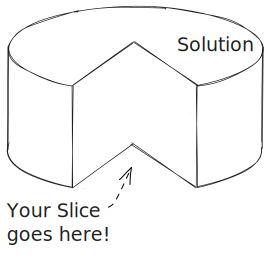
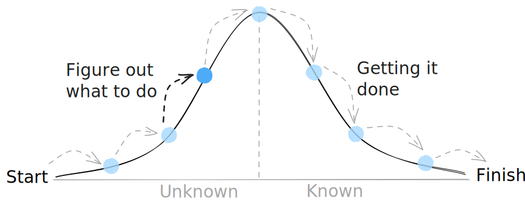
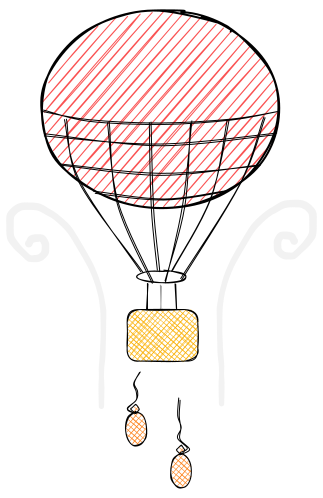

Some years ago I worked in a team of software developers which I still consider the most productive team I have ever been a part of. We built a large system for our internal users with a dozen product team members and had a turnaround time from _idea_ to _implementation_ of about three weeks. This is how we did it.

<!--more-->

## Day to day

The work that needed doing was split into two buckets: the eternal pull-queue of tasks like maintenance or smaller adjustments to existing services, and the frequent but short projects we did to build new services or make larger changes to existing ones.

Since the team had a very high degree of maturity and everyone's experience was basically on-par, we rotated everything. A typical month then was working on the pull-queue for the first week, being part of a project for the next two weeks and then getting to wind down again with a week of pull-queue. Rinse and repeat.

## Shape Up

The basis for our system was [Basecamp's Shape Up](https://basecamp.com/shapeup). We adapted it for our specific use-case, taking what made sense and slightly altering things to work well with already established processes or business realities we could not affect.

This didn't happen over night. The process was continuously re-examined and changed through the feedback of both developers doing the projects, managing team members chaperoning them and stakeholders/domain experts trying to get their requirements met.

### Shapes

The starting point for any project was a Shape; a basic description of a problem to solve and the **boundaries** of the solution. Crucially, it did not contain any requirements or descriptions of exactly what to built - and if anything looked like it, the project team was always free to ignore it entirely.

An important property of a shape was that it was **solved**, meaning it outlined a thought through solution for the problem on a _macro_ level. This also meant that stakeholders were involved in the process early and their domain knowledge had informed the shape.

As far as foresight would allow, it listed rabbit-holes and no-gos to establish the **boundaries** around the solution. Within these given boundaries, the eventual project team was free to find whatever implementation delivered value to users in the allotted time.

### Projects

Projects were always eight workdays. They were always based on a shape that was provided by managing members of the team. The project always had around four or five people attached to it, including developers, designers and domain experts. Every project had one project lead tasked with coordinating the project and communicating with stakeholders. Every project always had at least one stakeholder attached to it, available to validate assumptions and solutions with their domain knowledge.

We had one immutable rule in these projects: **Fixed time, variable scope**. We would never extend a project, instead cutting the scope to fit the available time. We'd be adamant about this, sometimes deciding to cut scope on the first day already. The goal was always to deliver value to users, _compared to their current baseline experience_.

In the rare instance where we failed to deliver at least _some_ value for users, we re-examined the projects progress and shape to try and understand why it didn't work out. After this, if the shape (with any changes applied) still seemed doable, we would schedule a follow up project a few weeks later. Same rules applied.

### Kick-Off

We'd have a single kick-off meeting in the afternoon on the day of the project start, giving members a chance to read the shape beforehand and clarify any open questions with the stakeholders also attending the meeting.

In later iterations of the process, we put more emphasis on walking through the _problem_ with the stakeholders present. We'd use the insights to challenge the shape directly with it's authors. This often uncovered small but important details not explicitly stated in the shape. We found that this happened when authors had gotten too familiar with a problem. Having this feedback loop helped to keep the phenomena in check.

It was understood that to begin work, a solid understanding was required first. The managing members and shape authors were tightly looped into this phase, which again served as a feedback loop for _their_ respective processes that had produced the shape.

### Work

Given the rough nature of a shape we were very careful about any work resulting from reading the shape only, going so far as to classify it as **imagined work**. This was work we expected to do based on what we read, informed by our existing preconceptions and biases. It was a necessary starting point, but not of much value.

Once we started working on the tickets resulting from _imagined_ work, we'd usually discover things were slightly different, more complicated or not at all as imagined. This was expected and understood to be so valuable! We called this work **discovered work**. This would end up being the bulk of actual work to do and was of high value.

The objective was to get from _imagined_ work to _discovered_ work as quickly as possible. To this end, we'd prioritize shipping iterations quickly to the staging environment, getting them into the hands of stakeholders early.

### Vertical Slices

{float="right"}

These iterations were vertical slices, starting of with many mocked layers which were gradually replaced by the actual implementations. The goal was to build something stakeholders could get their hands on early to determine if the solution would deliver the value we envisioned. If this turned out not to be the case, we could pivot early when making big changes was still relatively cheap.

The goal of these slices was always to _discover_ as much work as possible. To maximize this, we went for anything **novel** (what we hadn't built before) and **core** (what was central to the solution) first, choosing small pieces of _imagined work_. If no small pieces existed that matched the aforementioned criteria, we made the larger ones smaller by mocking extensively.

### From a Scope to Scopes

Since we were already building slices of the projects vertically, we planned them like this as well. The whole project was sliced into multiple smaller scopes, initially from _imagined_ work which was continuously replaced by _discovered_ work as we dug deeper into the tasks. The 1:1 relation between a scope and a vertical slice wasn't mandated but often occurred naturally.

The scopes were not drawn once. They were refined throughout the project many times, often settling only when most of the tasks inside them contained _discovered_ work. Scopes were usually settled when:

* We felt we could see the **entire** project just by looking at the scope names
* It was always clear what scope any new task would belong to

If this proved hard with the existing scopes, we would redrawn them until it was. This was accepted and reported on.

Special attention was put on naming these scopes. Names had to be clear and short because they would be referred to often in conversations and so gradually became part of the language spoken in the project. 

### Tasks

As tasks were placed into their respective scopes, we would categorize them into either an "uphill" or "downhill" phase of work. Any task would start of as "uphill" and remain there until it was clear exactly what had to be implemented and how.

We took this serious, only promoting something to "downhill" when we could validate (e.g. through a prototype) that everything was truly understood and going to work as we expected.

The tickets in a scope could then be summed up to show the overall phase of the scope. We'd aim to first get _all_ tickets out of the "uphill" phase before then implementing them all in a concentrated pair programming session. This drastically reduced the chances of complexity catching us off guard during implementation.

We'd try to finish one scope before tackling the next, except if progress was blocked or no primary scope had been chosen yet. Depending on the available project resources we would parallelize by working on multiple scopes simultaneously. 

Integrating more and more vertical slices this way made the overall progress of the project visible to all members. The increased visibility allowed us to prioritize the remaining scopes by impact together with stakeholders.

### Reporting

Since much emphasis was placed on scopes and they were part of the projects natural language already, they became our number one reporting tool as well. This also meant that if during reporting it was hard to tell exactly how 'done' a scope was, it wasn't a useful scope and needed to be redrawn.

Reporting was done by the project lead on a bi-daily basis. This may sound like a lot, but it forced the lead to be on top of all scopes and their current phase virtually all the time. This increased awareness of the overall progress and incentivized thinking about cutting scope early and often.

During the reporting, managing members of the project team could take the role of outside entities with a more detached view on the overall project momentum. Having the reports happen frequently meant we got to compare the project momentum as perceived by members of the project with what the outside entities perceived. This was usually valuable feedback and led to cutting scope when there was significant drift.

### Good enough

{float="left"}

With all the scope cutting, some colleagues felt they were failing to deliver. Cutting scope had previously been a last resort and doing it frequently felt like failing to deliver many times over. When a final result was achieved but didn't match what was envisioned in the shape or at the start of the project, these colleagues felt like the whole project was a failure.

Worse yet, when these colleagues felt like _their_ project needed to cut scope, they would instead sacrifice tests, documentation or pairing for perceived speed gains in the hopes of avoiding it. We found that, at best, this reduced the quality of delivered software significantly; if it worked out to deliver anything substantial at all.

To counteract this thinking, we put emphasis on comparing project outcomes to the _baseline_ experience for users before the project. We also made it clear that we would not compromise on software quality, knowing that - as a product company - we'd have to support bad software for longer than we'd like. It took a while until this paradigm shift took hold, but eventually it did.

## Difficulties

We were a small product team, meaning specialist roles such as Designers were in short supply.
This was tackled by having them work out wire-frames and interaction diagrams beforehand (as part of the shaping process).
The drawback of this was that when we decided to pivot the project, this work was outdated to some degree and updating it took longer than ideal.

More generally, a special group of people went off in secret to work on a shape that was then handed down to be worked on.
This meant it was hard for people outside of this group to get a sense of the overall direction we where heading in.
Or influence that direction.
The leads went to great pains to involve everyone in larger decisions, but the feeling of your own direct impact was muted quite a bit.

Organizational realities outside of our control meant that stakeholders were often added to projects _on top_ of their regular work. 
This meant they had less time available for the projects than we would have liked.
The consequence was that some amount of work was done based on speculation before it could be validated, at times resulting in wasted effort.

We used to say the product team in this company existed "on an island".
Were our processes had feedback loops and gave room for creativity, the rest of the company ran on static hierarchical processes.
That made it jarring for stakeholders from such teams to be open to explore the problem space or embrace uncertainty.
We attempted an onboarding process to prepare them, but this was only partially successful.
This was a challenge on the level of the whole organization.

Not everything was fantastic all the time, as is often the case in the real world. But I still remember the time I had with this team fondly.
