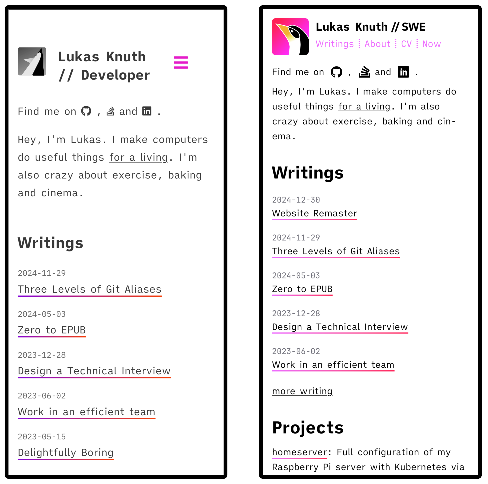
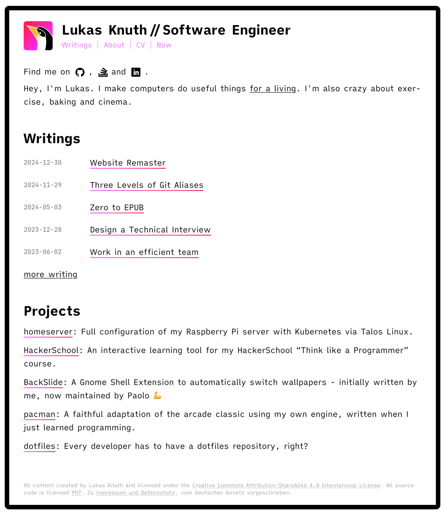

When I set up this version of the website I opted for a ready to use theme instead of making my own.
Then, some time ago, I started simplifying everything I could about my setup.
I value when things are easy to understand, maintain and extend.

The new year was a great excuse to redo the perfectly good website in Tailwind CSS.
It's everywhere in web development now, and I wanted to get more familiar.

<!--more-->

## Design Rework

The homepage now uses the vertical space better, especially on mobile.
This includes the header, which was the largest eye-sore.
I got rid of the hamburger menu that served very little purpose.
Instead, now the menu shrinks on smaller viewports and is fully presented.

I also updated the color scheme based on Tailwinds palette.
The logo no longer has the grayscale effect applied to it, so now it pops more on the page.
It also graduated from programmer art to a more sophisticated almost artistic rendering.
I'm not an artist, but I'm very happy with the result.



On larger screen sizes - an iPad in this example - I use the additional horizontal space.
The font size is scaled up as well, which I feel greatly contributes to reading comfort.



Overall the new design improves on the old one while keeping most of it intact.
Why fix what isn't broken?

## Nothing left to take away

I removed as much _stuff_ as I could.

The old theme had some JavaScript that wasn't really doing much, but it required jQuery to work.
In the new version, everything is just CSS, no more JavaScript at all.

I followed the [Mozilla "image type and format guide"](https://developer.mozilla.org/en-US/docs/Web/Media/Formats/Image_types#choosing_an_image_format) and updated most graphic assets to SVG or WebP files.
This also includes making more modern favicons - yes, [it's a whole thing](https://realfavicongenerator.net/)

I copied most of the layouts from the previous theme [cactus by monkeyWzr](https://github.com/monkeyWzr/hugo-theme-cactus).
However, I was able to greatly simplify most of the logic because I don't need to be as flexible as a general purpose theme.

## It's faster

Looking at the **Home Page** stats is a good start because article pages just have more HTML content and possibly additional assets - like images. 
Here are the values for an _empty cache_ request for the **old** website, measured using the Firefox performance tool:

| Type   | Size    | Transferred | Time |
| ------ | ------- | ------- | -------- |
| fonts  | 1558 kB | 1568 kB | 1,68 sec |
| css    | 138 kB  | 20 kB   | 0,44 sec |
| images | 130 kB  | 95 kB   | 0,26 sec |
| js     | 91 kB   | 1217 kB | 0,45 sec |
| html   | 35 kB   | 15 kB   | 0,20 sec |
| **Total** | **1952 kB** | **2915 kB** |

Notably the biggest factor is the fonts I use on the website.
There were five in total, including an icon font and the handwriting font used by Excalidraw to have the SVGs render correctly.

I don't use any CDN for my website - which means there is a low chance that fonts are already in the user's cache.
If I had taken them directly from Google Fonts, they would have probably cached better.
I decided against doing this for [privacy reasons](https://wptavern.com/german-court-fines-website-owner-for-violating-the-gdpr-by-using-google-hosted-fonts) and haven't changed my mind on this.

Here are the numbers for the **new** website:

| Type   | Size   | Transferred | Time |
| ------ | ------ | ------- | -------- |
| fonts* | 222 kB | 228 kB  | 0,32 sec |
| images | 222 kB | 155 kB  | 0,12 sec |
| css    | 20 kB  | 6 kB    | 0,03 sec |
| html   | 9 kB   | 5 kB    | 0,10 sec |
| js     | -      | -       | -        |
| **Total** | **473 kB** | **388 kB** |

The icons are now an SVG sprite atlas, a single file containing all required logos - no need for the whole icon font anymore.
Excalidraw recently implemented [embedding fonts in SVG exports](https://github.com/excalidraw/excalidraw/issues/1972#issuecomment-2417744618), which means I no longer need to provide their font either - though I had to re-export the SVGs with the newest version of Excalidraw.

Fonts have an asterisk because the table above represents the "worst case scenario" where the fonts actually need to be downloaded.
It's reasonable to assume that this transfer can be avoided at least partially for many visitors.
More in the next section.

While the difference is clearly measurable, I don't think the average visitor will _feel_ it.
This is fine though.
I can live with having optimized this just for me.

### Optimization: Fonts

> [!caution]
> This setup is **not what I use anymore**.
> I made further optimizations and have gotten rid of the `local()` directions for consistency.
> The reasons are outlined in [this follow-up post]().

The fonts remain the largest assets fetched for an uncached request.
As mentioned above, I removed all fonts except [iA Writer Quattro](https://github.com/iaolo/iA-Fonts/) for text and [JetBrains Mono](https://www.jetbrains.com/lp/mono/) for code.
But we can do more.

Since this is a blog largely about software engineering, it stands to reason that many readers have a background in the field.
As such, some of them might already have at least the JetBrains Mono font installed on their system.
For those lucky ones, we can simply use their locally installed font instead of downloading it again:

```css
@font-face {
  font-family: "JetBrains Mono";
  font-style: normal;
  font-weight: 400;
  font-display: swap;
  src: local("JetBrainsMono-Regular"),
    local("JetBrainsMonoNL-Regular"),
    local("JetBrainsMonoNerdFontComplete-Regular"),
    local("JetBrainsMonoNerdFontCompleteM-Regular"),
    local("JetBrainsMonoNerdFontCo-Regular"),
    url("/fonts/JetBrainsMono-Regular.woff2") format("woff2");
}
```

This idea was taken from [Jonathan Hethey](https://jonathanmh.com/p/webfonts-using-local-fonts-as-source/).
I extended it by adding the names these fonts have when installed via popular font collections like NerdFonts.

### Optimization: Tailwind

When setting up Hugo to use Tailwind, I learned it [integrates directly](https://github.com/bep/hugo-testing-tailwindcss-v4) with Tailwind 4 (currently in Beta).
This setup seemed much simpler than the older ones using PostCSS pipelines, so I picked it.

The Tailwind CLI removes any unused classes from the final CSS before minifying it, shrinking the CSS significantly out-of-the-box.
But, in Tailwind 4, all design tokens are now [exposed as CSS variables](https://tailwindcss.com/docs/v4-beta#css-theme-variables).
As of now, the Tailwind CLI does not remove variables if they are unused - that is, all classes that use the variable have been removed.

For my (relatively small) output, this meant that about 50% of it was variable definitions - like the extensive color palette - that I never used anywhere.
So I manually [unset all unused variable namespaces](https://tailwindcss.com/docs/v4-beta#overriding-the-default-theme) from the default theme:

```css
@theme {
  --color-*: initial; /* remove all default Tailwind Colors */
  --color-primary: oklch(0.74 0.238 322.16); /* --color-fuchsia-400 */

  --font-*: initial; /* remove all default Tailwind fonts */
  --font-sans: "iA Writer Quattro", ui-sans-serif, system-ui, sans-serif;

  /* Remove other unused Tailwind variables */
  --ease-*: initial;
  --animate-*: initial;
}
```

This reduces the final output CSS file by about 40%.
The tradeoff is that when using a Tailwind utility in the HTML `class` attribute which relies on a removed variable, it won't work correctly.
For utilities applied using `@apply` directly in CSS, Tailwind CLI will print an error though.

## Some new stuff

Along the way, I read up more on how Hugo theming works.
Especially the [render hooks](https://gohugo.io/render-hooks/), which allow me to extend how markdown blocks are rendered to HTML.

> [!tip]
> I made callout boxes to highlight important stuff.
> There are other callout types as well.

There are many more small changes.
If you're curious, you can check out the [feature branch](https://github.com/LukasKnuth/lknuth.dev/commits/feature/tailwind4-theme/).

The entire remaster took me about three weeks of easy work in between other things.
I'm very happy with the result.
